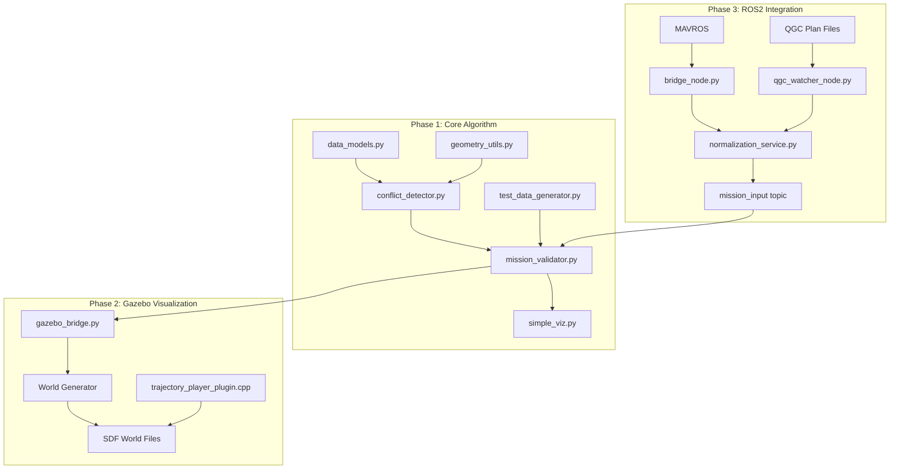

# UAV Deconfliction Project Walkthrough

I have successfully implemented the complete spatial **and temporal (4D)** deconfliction system for UAV trajectories.

## Project Structure

### Project Architecture Overview



### Directory Structure

| Path | Purpose | Phase |
|------|---------|-------|
| `uav_deconfliction/src/` | Core algorithm modules | 1 |
| `uav_deconfliction/tests/` | Automated test suites | 1 |
| `uav_deconfliction/src/legacy/` | Gazebo bridge & world generation | 2 |
| `uav_deconfliction/gazebo_plugins/` | C++ Gazebo Harmonic plugin | 2 |
| `uav_deconfliction/ros2_bridge/` | ROS2 nodes, services, converters | 3 |
| `uav_deconfliction/deconfliction_msgs/` | Custom ROS2 message/service defs | 3 |

---

## Phase-by-Phase Analysis

### Phase 1: Core Deconfliction System ✅ STABLE

**Objective**: Create a working, testable deconfliction algorithm with visual validation.

#### Key Components

| File | Responsibility | Highlight Design |
|------|----------------|------------------|
| `data_models.py` | `Waypoint`, `Mission`, `Conflict` dataclasses | Immutable value objects with validation in constructors |
| `geometry_utils.py` | B-spline trajectory generation, spatial calculations | Uses `scipy.interpolate.splprep` for smooth curves |
| `conflict_detector.py` | Low-level spatial/temporal conflict checking | Discrete sampling with configurable density |
| `mission_validator.py` | High-level validation orchestration, reporting | Facade pattern, severity categorization |
| `simple_viz.py` | Matplotlib 3D animation | Pure Python, no external dependencies |

**Key Assumptions**:
- Waypoint timestamps are **absolute mission-local time** (seconds from mission start)
- B-spline parameter `u ∈ [0,1]` maps linearly to waypoint indices, not time
- Safety buffer is **symmetric** (same for both missions)
- Temporal tolerance is a "near-simultaneous" window, not exact match

### Phase 2: Gazebo Harmonic Integration ⚠️ EXPERIMENTAL

**Objective**: Move from Matplotlib to a real-time 3D simulator used in drone development.

#### Architecture Pattern: File-Based IPC

**Design Rationale**: Avoiding ROS2/Gazebo transport complexity for quick prototyping.

**Known Issues**:
- **Coordinate System Mismatch**: The Python playback writes positions in the mission's local ENU frame, but the Gazebo world origin matches (0,0,0) without transform.
- **Visibility**: Drones may not render correctly due to camera positioning or missing mesh assets.

### Phase 3: ROS2 Bridge System 🔄 IN PROGRESS

**Objective**: Connect to real drone ecosystems (ArduPilot/PX4 via MAVROS, QGroundControl plans).

#### Data Flow

1. **MAVROS Bridge** (`bridge_node.py`):
   - Subscribes to `mavros_msgs/WaypointList`
   - Converts GPS (lat/lon/alt) to local ENU via flat-earth approximation
   - Computes timestamps based on assumed speed

2. **QGC Converter** (`qgc_converter.py`):
   - Parses MAVLink `MAV_CMD_NAV_WAYPOINT` items
   - Establishes home reference from `plannedHomePosition`
   - Uses `utils.geodetic_to_enu()` for coordinate conversion

3. **Normalization Service** (`normalization_service.py`):
   - Validates structure (2+ waypoints, coordinate bounds)
   - Applies defaults (drone_id, safety_buffer, time_window)
   - Returns normalized JSON for deconfliction pipeline

**Current Blockers**:
- **Missing SITL/MAVROS Test Environment**: Bridge coded but untested with live MAVROS streams.

---

## 4D Spatiotemporal Deconfliction

### The Core Innovation

Traditional 3D conflict detection would reject two missions that **cross paths**, even if they pass through the intersection point **at different times**. The 4D approach adds temporal reasoning:

```python
# Two missions crossing in space but separated by 10 seconds
m1: passes (50, 0, 50) at t=5s
m2: passes (50, 0, 50) at t=15s

# Spatial-only check: ❌ REJECT (paths intersect)
# Spatiotemporal check: ✅ APPROVE (10s temporal separation > 0.5s tolerance)
```

### Implementation Logic

1. Find spatial closest approach point via dense sampling.
2. Map spline parameter `u` to mission timestamp.
3. Compare timestamps at closest approach.
4. Apply `temporal_tolerance` window.

---

## System Capabilities & CLI Usage

1.  **Curve-Based Trajectories**: Uses B-splines to model realistic, smooth flight paths.
2.  **Spatial Conflict Detection**: Accurately calculates the closest approach in 3D space.
3.  **Temporal Deconfliction (4D)**: Checks if spatial conflicts actually occur at the same time.
4.  **Validation Reports**: Detailed reports with spatiotemporal analysis.

### Run Test Scenarios

Execute predefined scenarios to visualize system capabilities:
```bash
# Run a crossing conflict scenario
./uav_deconfliction/main.py --scenario crossing

# Run a complex random scenario
./uav_deconfliction/main.py --scenario complex --safety-buffer 10.0
```
Available scenarios: `crossing`, `parallel`, `altitude`, `complex`, `spiral`, `near_miss`.

### Validate Custom Missions

Validate your own mission files against traffic data:
```bash
./uav_deconfliction/main.py \
    --validate uav_deconfliction/data/example_mission.json \
    --traffic uav_deconfliction/data/example_traffic.json \
    --output-dir my_results
```
Results (report JSON and 3D visualization) are saved to the specified output directory.

---

## Automated Testing

### 1. Spatial Tests (`tests/test_validation.py`)
- `test_conflict_spatial_violation`: Detects 3D intersection.
- `test_conflict_parallel_too_close`: Verifies buffer sensitivity.
- `test_altitude_separation`: Confirms 3D height checking.
- `test_multiple_conflicts`: Batch validation logic.

### 2. Temporal Tests (`tests/test_temporal_logic.py`)
- `test_temporal_separation_clear`: Verifies that missions crossing in space but separated by time (e.g., 10s delay) are **APPROVED**.
- `test_spatiotemporal_conflict`: Verifies that missions crossing in space AND time are **REJECTED**.

---

## Visualization

### Matplotlib Animation (Recommended)

The primary visualization is a self-contained Matplotlib 3D animation.

**Features:**
- Dynamic 3D playback of drone trajectories
- Green trails showing flight paths
- **Automatic red warning** when conflict is detected
- Conflict marker and timestamp displayed
- GIF export for easy sharing

**Usage:**
```bash
cd uav_deconfliction
python src/simple_viz.py
```


### Gazebo Harmonic Integration (Experimental)

> [!WARNING]
> Use Matplotlib for reliable visualization. The Gazebo integration is experimental and has known coordinate system issues.

See `uav_deconfliction/dev/gazebo_legacy/README.md` for original setup instructions.

---

## Code Structure & Maintainability Analysis

### Strengths

- **Modular Design**: Each file has single responsibility; facade pattern in `mission_validator.py`.
- **Defensive Programming**: Constructor validation in `Mission`, `Waypoint`; try/except in importers.
- **Documentation**: Every function has docstrings with Args/Returns/Examples.
- **Graceful Degradation**: ROS2 nodes work in "decoupled mode" without full stack.

### Areas for Improvement

1. **Hardcoded Constants**: Values like `safety_buffer=5.0` are scattered. **Future**: Create `config.py`.
2. **Import Path Fragility**: Relying on `try/except` for imports. **Future**: Use proper package structure.
3. **Missing Type Hints**: Some utility functions lack rigorous typing.

---

## AI-Paired Development Observations

### Prompt Engineering Patterns
The codebase shows signs of **spec-driven AI development**:
1. **Chained Prompts**: Each phase built on explicit requirements.
2. **Placeholder Functions**: Iterative prompting indicated by `# FUTURE IMPLEMENTATION PLACEHOLDER` sections.
3. **Test-First Hints**: Test files typically match implementation patterns.

### Observed Pitfalls
- **Over-generated Code**: `gazebo_bridge.py` contained unused features due to broad prompts.
- **Inconsistent Naming**: Minor inconsistencies between modules (e.g., `check_trajectory_conflict` vs `validate_mission_pair`).

---

## Future Roadmap

### Short-Term (1-2 Sprints)
- 🔴 Fix Gazebo coordinate transform.
- 🔴 Test ROS2 bridge with SITL.
- 🟡 Add proper geodetic library (PROJ/pyproj).

### Medium-Term (1-2 Months)
- 🟡 Spatial indexing (R-tree) for efficiency.
- 🟢 Bi-directional MAVROS (push modified plans back).

### Long-Term (Production Path)
- **Hardware-in-Loop**: PX4 SITL + QGC + ROS2 bridge full integration test.
- **Real Telemetry**: Ingest live MAVLink from physical aircraft.
- **UTM Integration**: Connect to NASA/FAA UTM systems.