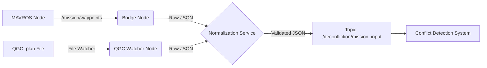

# ROS2 Bridge Integration Guide

## 1. Overview
This integration bridges standard MAVLink-based systems (ArduPilot/PX4 via MAVROS) and QGroundControl mission plans into the **UAV Deconfliction System**. It ingests waypoint data, normalizes it into a standard JSON format, validates mission constraints, and publishes it for conflict detection.

## 2. Prerequisites
*   **OS**: Ubuntu 22.04 (Jammy)
*   **ROS2**: Humble Hawksbill (or Iron/Rolling)
*   **Dependencies**:
    *   `ros-humble-mavros`
    *   `ros-humble-mavros-msgs`
    *   Python 3.10+
*   **Build Tool**: `colcon`

## 3. Quick Start

### Installation
```bash
# 1. Clone/Enter repository
cd uav_deconfliction

# 2. Build the packages
colcon build --packages-select deconfliction_msgs ros2_bridge

# 3. Source the environment
source install/setup.bash
```

### Running the System
Start the Bridge, Normalizer, and File Watcher in one command:
```bash
ros2 launch ros2_bridge system.launch.py safety_buffer:=10.0
```

### Testing
**Method A: QGC File Import**
Drop a `.plan` file into the watched directory (default: `~/qgc_missions`):
```bash
cp ros2_bridge/tests/data/sample.plan ~/qgc_missions/
# Check logs: "Published QGC plan..."
```

**Method B: ROS Service**
Manually inject a mission JSON:
```bash
ros2 service call /normalize_mission deconfliction_msgs/srv/NormalizeMission '{input_json: "{\"waypoints\": [{\"x\":0,\"y\":0,\"z\":10}, {\"x\":50,\"y\":0,\"z\":10}]}"}'
```

## 4. Architecture Diagram


## 5. Data Flow
1.  **Ingestion**:
    *   **MAVROS**: Subscribes to `mavros_msgs/WaypointList`. Converts Lat/Lon to Local ENU (flat earth).
    *   **QGC Watcher**: Parses `.plan` JSON. Extracts `MAV_CMD_NAV_WAYPOINT`.
2.  **Normalization**:
    *   Validates minimal structure (2+ waypoints).
    *   Assigns `drone_id` (default or parameterized).
    *   Calculates `time_window` (start/end) based on flight speed (default 5 m/s).
    *   Injects `safety_buffer`.
3.  **Output**:
    *   Publishes finalized JSON string to `/deconfliction/mission_input`.

## 6. Troubleshooting

| Issue | Cause | Fix |
| :--- | :--- | :--- |
| **"Package not found"** | Environment not sourced | Run `source install/setup.bash` |
| **"Service not available"** | Node crashed or not running | Check `ros2 node list`. Ensure `setup.py` entry points match. |
| **"ImportError: No module..."** | Missing dependencies | `sudo apt install ros-humble-mavros-msgs` |
| **No output from Bridge** | No MAVROS data | Verify `ros2 topic echo /mavros/mission/waypoints` has data. |

## 7. Next Steps
*   **Geodetic Precision**: Replace flat-earth approx with `geographic_msgs`/PROJ.
*   **Bi-directional**: Allow Deconfliction System to upload modified plans back to MAVROS.
*   **Multi-Drone**: Namespace the bridge nodes to handle multiple active inputs.

## 8. Beyond Requirements: Real-World Integration
This ROS2 integration acts as the critical link converting a theoretical deconfliction algorithm into a field-deployable safety system. By standardizing on MAVLink via MAVROS, we ensure seamless compatibility with the vast majority of commercial drone platforms (ArduPilot/PX4) used in industry today. This move away from custom simulation interfaces to protocol-compliant bridges means the system is "hardware-ready" by design, capable of ingesting live telemetry from physical aircraft without modification.

Practical deployment is further addressed through the QGroundControl workflow integration. Operators can leverage industry-standard mission planning tools, exporting complex flight paths directly into the deconfliction pipeline. This decoupling of mission generation from safety validation is a key architectural pattern in autonomous systems, allowing for robust testing and verified safety buffers before a propeller ever turns. This integration signals a shift from academic exercises to a robust, modular architecture essential for real-world Unmanned Traffic Management (UTM) prototyping and deployment.
